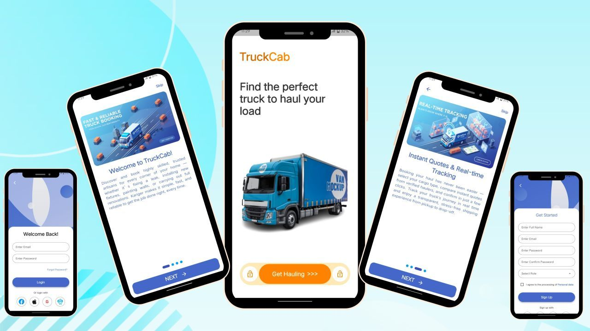
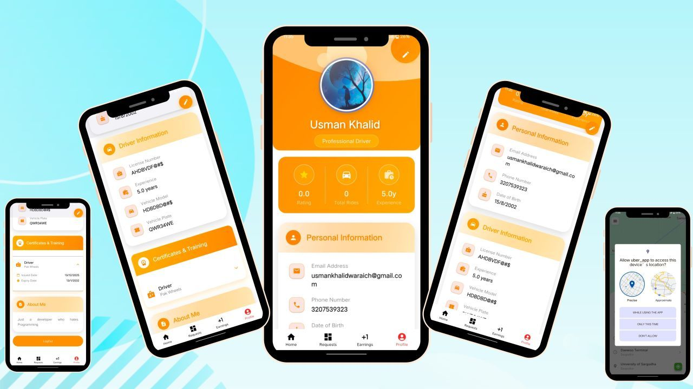
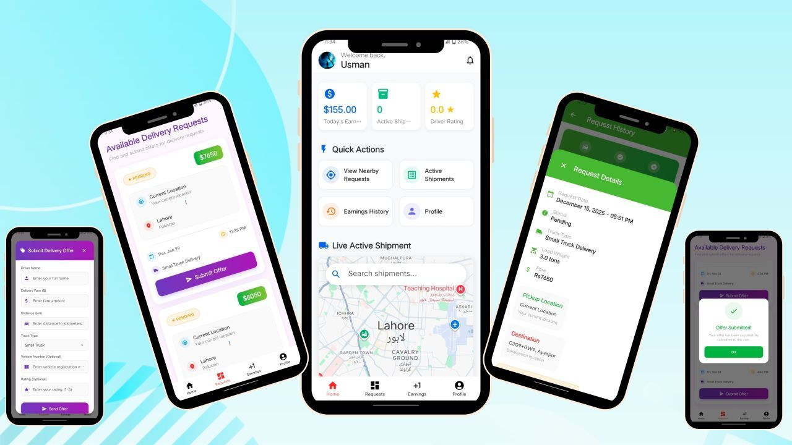
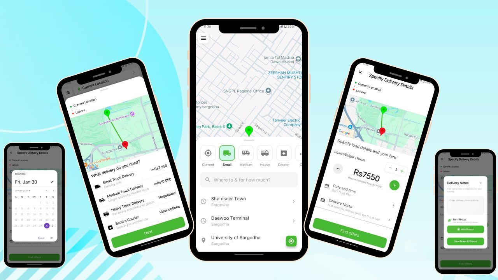
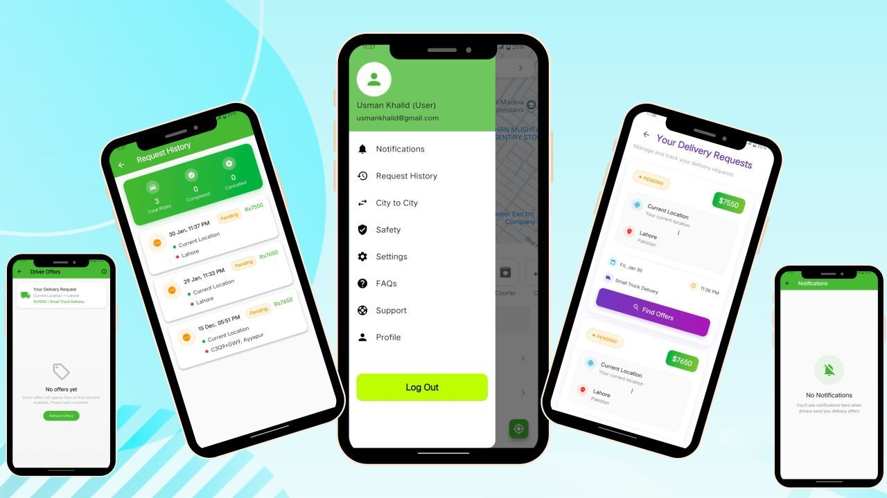
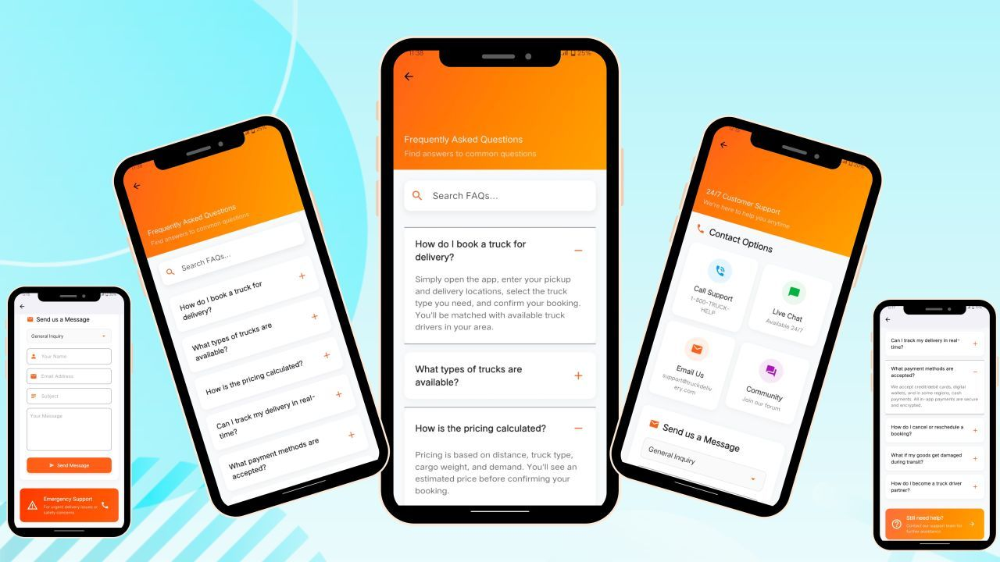

# 🚚 Truck Cab — Logistics & Transportation Platform

## 📱 About The Project

Truck Cab is a powerful logistics and transportation platform developed using Flutter, designed to connect shippers and carriers through a modern, scalable, and real-time ecosystem.

The application combines both User and Driver modules into a single high-performance platform, enabling smooth booking, live tracking, secure verification, and efficient cargo transportation management.

Successfully developed for an international client during my time at App Sustain Pvt Ltd, the project focuses on delivering reliability, performance, and a seamless user experience across Android and iOS devices.

---

# 🌟 Project Highlights

- 🚛 Logistics & Transportation System
- 👨‍✈️ Driver & User Modules
- 📍 Live Cargo Tracking
- 🗺️ Google Maps Integration
- 💰 Real-Time Earnings Dashboard
- 🔐 Firebase Authentication & Verification
- ⚡ Real-Time Firestore Synchronization
- 📱 Modern Responsive UI

---

# 🛡️ Driver Module — Command Center

Designed for high-efficiency driver management and real-time operations.

### Features

- 📊 Real-time earnings dashboard
- ⭐ Driver ratings & analytics
- 🗺️ Google Maps routing system
- 📍 Live geolocation tracking
- 🔐 Secure document & license verification
- 🚛 Trip management system

---

# 👤 User Module — Premium Experience

Built for simplicity, speed, and reliability.

### Features

- 🚚 Smart truck booking system
- 📦 Select truck types (Small, Medium, Heavy)
- 📍 Live cargo tracking
- 💬 Transparent bidding & negotiation system
- ⚡ Fast booking workflow
- 🔔 Real-time transportation updates

---

# 💻 Technical Highlights

- MVVM Clean Architecture
- Real-Time Firestore Sync
- Responsive Flutter UI
- Google Maps SDK Integration
- Firebase Secure Authentication
- Scalable & Production-Ready Structure
- Optimized Performance & Navigation

---

# 🛠️ Tech Stack

| Technology | Usage |
|------------|-------|
| Flutter | Frontend Development |
| Dart | Programming Language |
| Firebase | Backend & Authentication |
| Cloud Firestore | Real-Time Database |
| Google Maps SDK | Navigation & Tracking |
| MVVM | Application Architecture |
| VS Code | Development Environment |

---

# 🌍 Project Achievement

Successfully architected, designed, and developed the complete Truck Cab ecosystem for an international client, managing both driver and user experiences from scratch.

---

# 📱 Application Screenshots

  

---

# 🚀 Future Improvements

- AI Route Optimization
- In-App Payments
- Fleet Management Dashboard
- Multi-Language Support
- Delivery Analytics System
- Push Notifications

---

# 🤝 Let’s Connect

Open for Flutter development, logistics systems, and scalable mobile app projects.

📩 Available for freelance & remote opportunities.

---

# ⭐ Support

If you like this project, don't forget to star the repository ⭐
